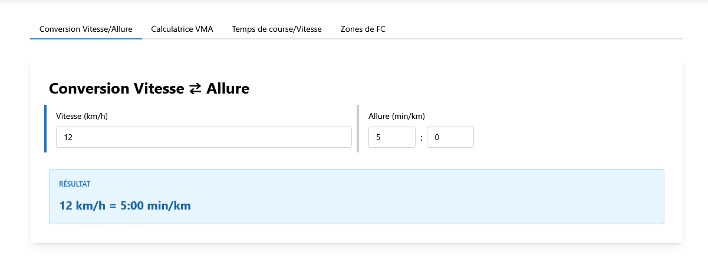

# Running Conversions

A simple web app for converting running paces and speeds between different units.

**Live site**: https://running-conversions.rcoudert.com/

## Screenshot



## Features

- Convert between min/km and km/h
- Calculate VMA-based race predictions across multiple distances
- Calculate race times and required speeds for specific finish times
- Heart rate zone calculator using the Karvonen formula
- Clean and intuitive interface
- Real-time conversions
- Available in English and French

## Getting Started

```bash
# Install dependencies
npm install

# Run development server
npm run dev

# Build for production
npm run build
```

## License

This project is licensed under the MIT License - see the [LICENSE](LICENSE) file for details.

## Attribution

<a href="https://www.flaticon.com/free-icons/running" title="running icons">Running icons created by surang - Flaticon</a>
